---
authors:
  - boegel
date: 2026-04-21
slug: eum26-day1
hide:
  - navigation
---

# EUM'26 - Day 1

The [11th EasyBuild User Meeting (EUM'26)](https://easybuild.io/eum26/)
took place in the beautiful city of Guimarães, the home of the EuroHPC supercomputer *Deucalion*.

<figure markdown="span">
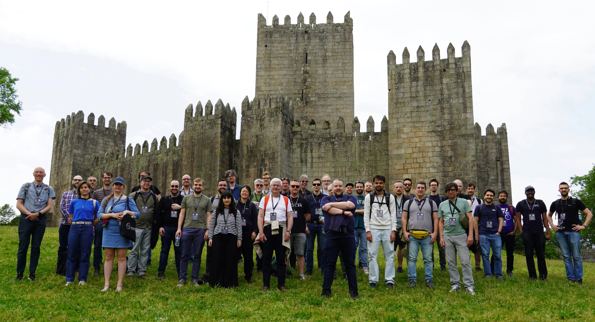{width=100%}
</figure>

The EasyBuild community (and beyond) gathered again to learn more about recent developments,
letting HPC sites that use EasyBuild showcase how they are doing so, attend presentations on
projects (loosely) related to EasyBuild, and discuss the future of EasyBuild,
including the (potential) impact of LLMs.

The event was sponsored by [Centro Nacional de Computação Avançada (the Portuguese National Center
for Advanced Computing)](https://acnca.pt/?lang=en), [INESC TEC](https://www.inesctec.pt/en),
[Fujitsu](https://global.fujitsu/), [Do IT Now](https://www.doitnowgroup.com/),
[Inuits](https://inuits.eu/), [Microsoft Azure](https://azure.microsoft.com/en-us),
and [NVIDIA](https://www.nvidia.com/).

This blog post covers the first day of the 3-day event, see also [day 2](eum26-day2.md) and [day 3](eum26-day3.md).

<!-- more -->

## Kickstart with social event

The 11th EasyBuild User Meeting (EUM) started off a bit atypically: with a tour of the local EuroHPC supercomputer
named [*Deucalion*](https://www.macc.fccn.pt/resources#deucalion), followed by a guided tour of Guimarães,
the host city for the event and also the birth place of Portugal.

Social activities have been part of the EUM program before, especially if you consider the group dinners,
and the "team building"-like side steps we have done in recent years. See for example the karting race that was
organised to celebrate the [10th EasyBuild User Meeting last year](../../2025/03/eum25.md).

Nevertheless, attendees took the opportunity to meet up with people they haven't seen in a while, or perhaps have
only met online until then. The custom professsionally designed badges that everyone was invited to wear 
were a great conversation starter, since they also feature GitHub handles. In some cases, even the band T-shirt
that some people happened to wear triggered people to talk to each other. :wink:

<figure markdown="span" style="display:flex; gap:0; justify-content:center;">
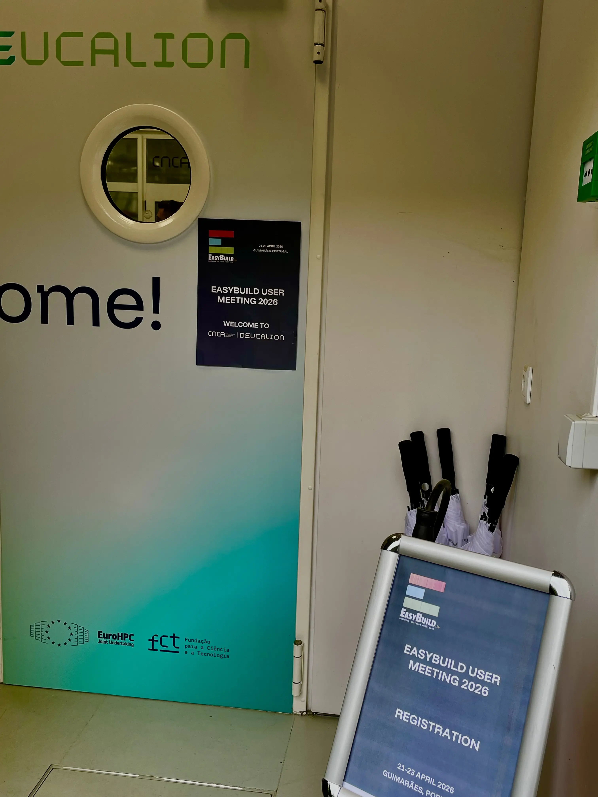{width=50%}
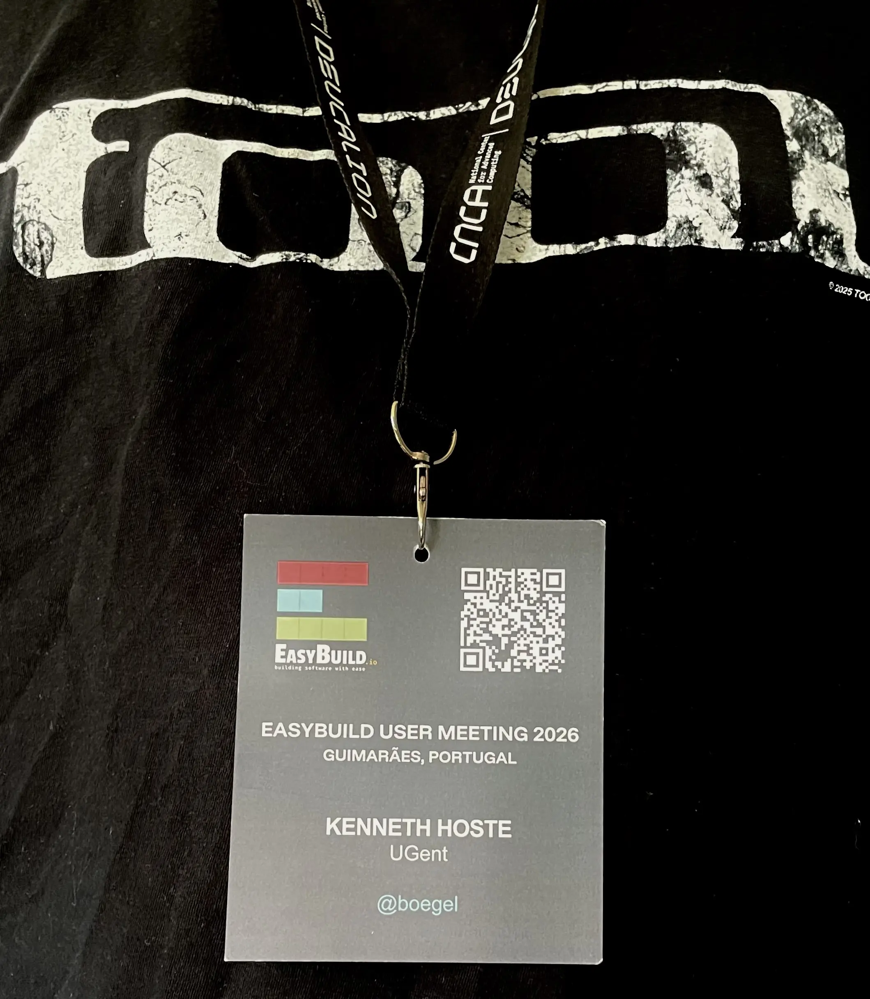{width=50%}
</figure>

### Visit of Deucalion

Bernardo from the Deucalion team kickstarted the visit by explaining a couple of things outside first.

<figure markdown="span">
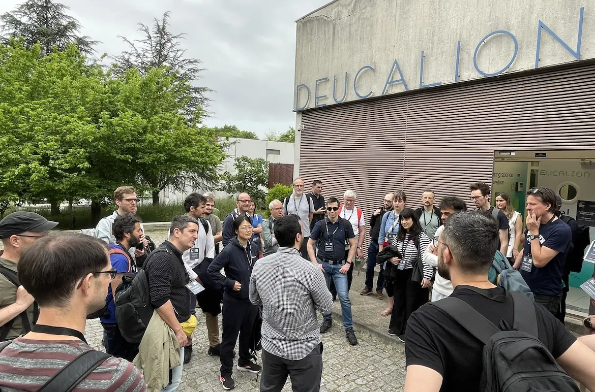{width=100%}
</figure>

In small self-organised groups, we walked through the noisy and (surprisingly) chilly room in which Deucalion
was humming away running scientific calculations for researchers from Portugal and all across Europe.

<figure markdown="span">
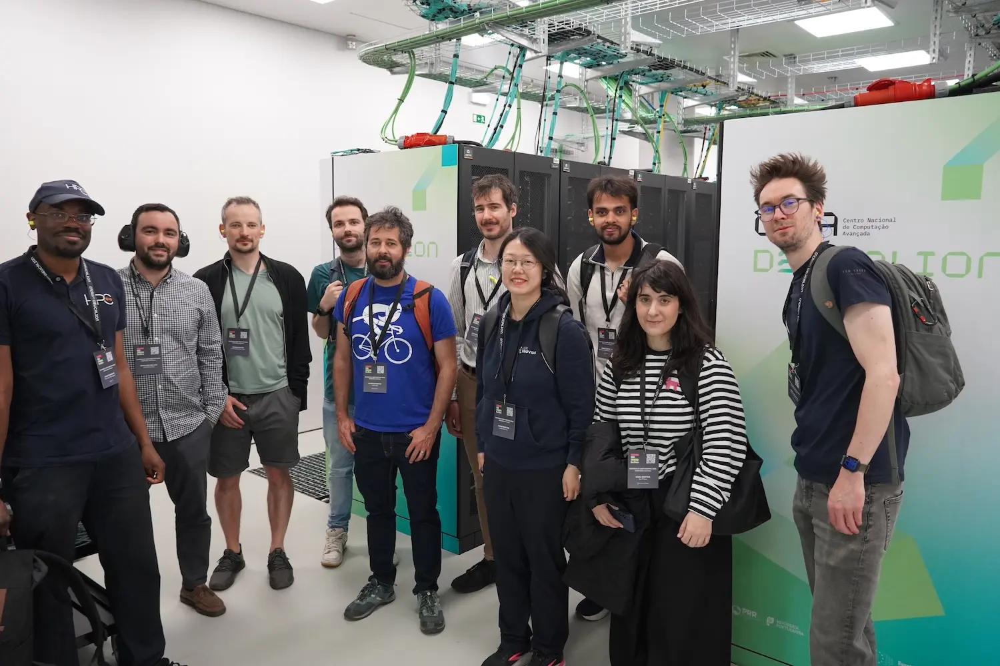{width=100%}
</figure>

<figure markdown="span">
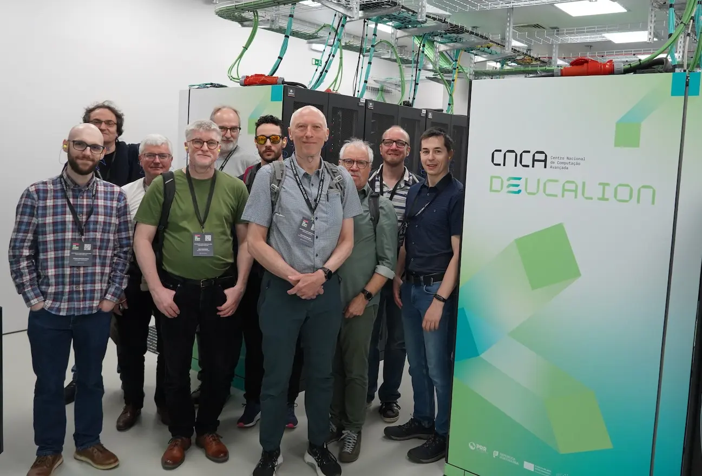{width=100%}
</figure>

We got to see the relatively new artwork and custom logo of Deucalion up close,
and many agreed that is was really well done.

<figure markdown="span">
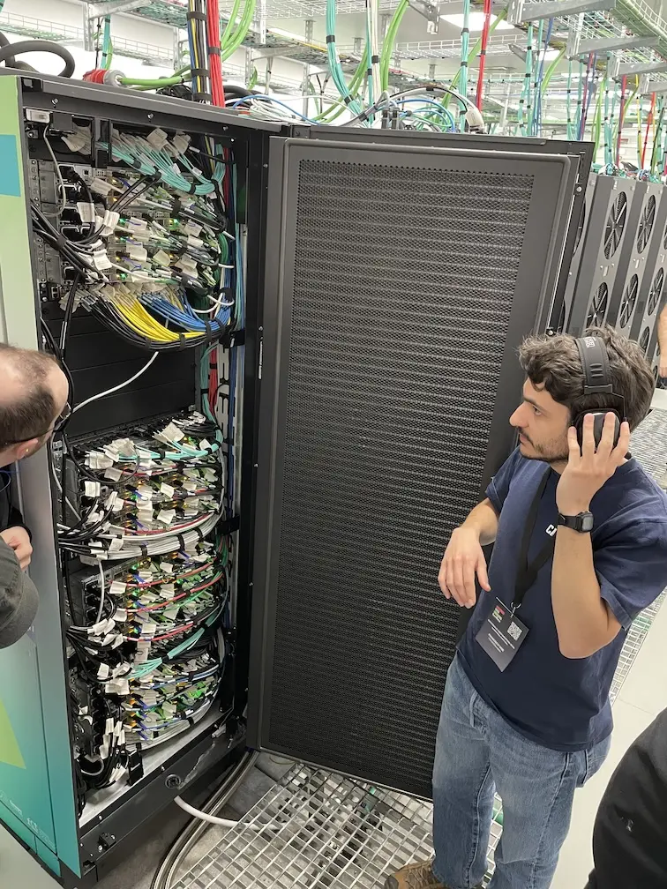{width=60%}
</figure>

A peek behind the watercooled doors at the back of each rack revealed that the cable work
is impressively clean and organised.

<figure markdown="span">
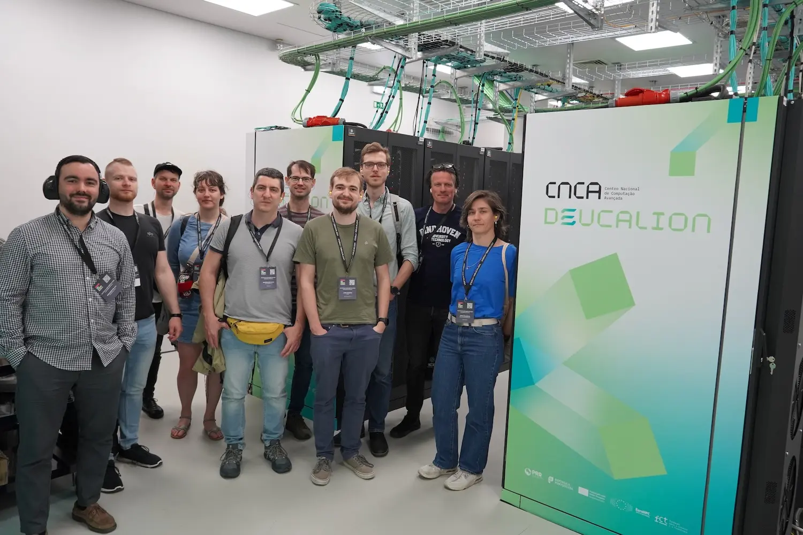{width=100%}
</figure>

<figure markdown="span">
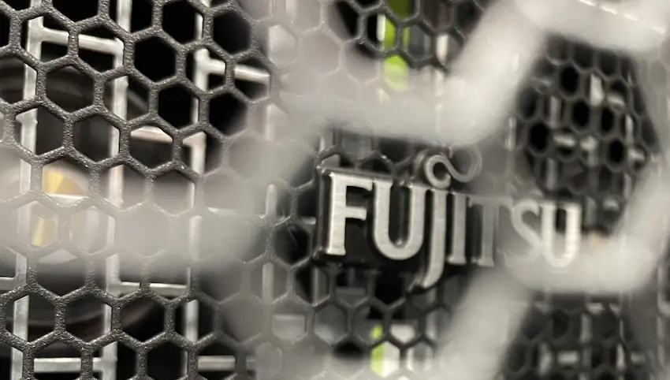{width=100%}
</figure>

Deucalion consists of essentially three partitions:

- a 500-node CPU-only partition with AMD Rome CPUs;
- a 1,632-node partition with Fujitsu A64FX (Arm) CPUs;
- and a GPU partition 132 NVIDIA A100 GPUs;

For more technical details on Deucalion, [see the documentation](https://docs.deucalion.macc.fccn.pt/deucalion/).

<figure markdown="span">
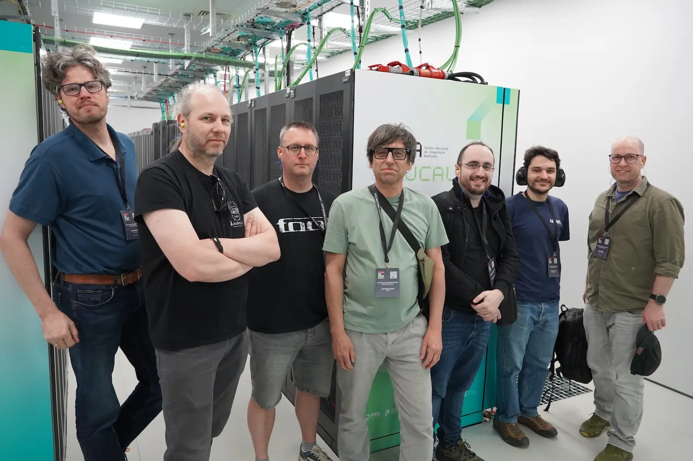{width=100%}
</figure>

<figure markdown="span">
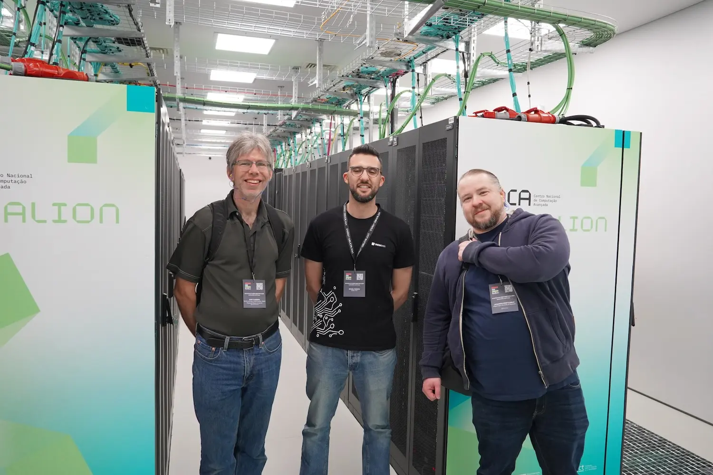{width=100%}
</figure>

Bart and Leonardo got so caught up in discussions while waiting for their turn outside in the sun
that they almost missed the tour!  
Miguel from the Deucalion team still granted them a quick look at the system
before re-joining the rest of the group.

<figure markdown="span">
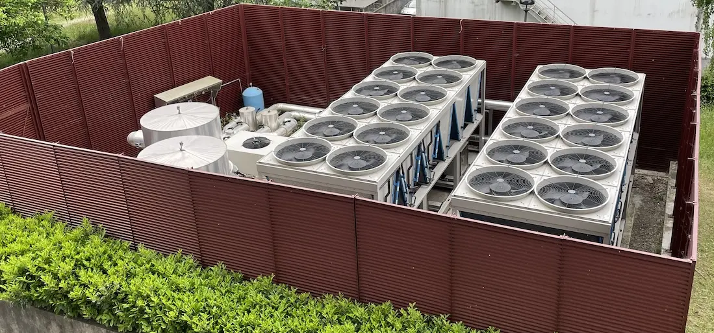{width=100%}
</figure>

The tour was wrapped up with a look at the chillers right next to the build housing Deucalion,
which is another critical part of the infrastructure.

After a quick refreshing drink or a cup of coffee or tea, we walked to the start of the guided city tour.

Along the way, we could see the new datacenter being constructed on the University of Minho campus.

<figure markdown="span">
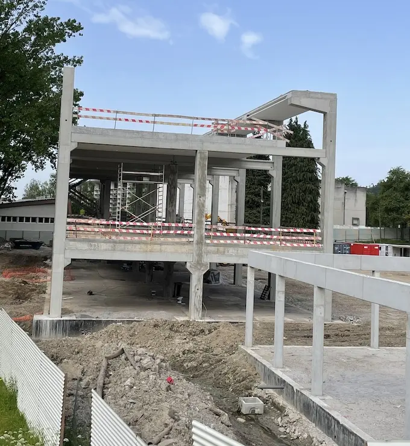{width=60%}
</figure>

### Guimarães city tour

We started the tour at Castelo de Guimarães (Guimarães Castle), a UNESCO World Heritage site,
with a brief word by our guide for the next hour on the long and tumultuous history of Portugal.

Some of the younger attendees quickly checked their TikTok feed to see if there were any new dances
to learn along the way. Kids these days...

<figure markdown="span">
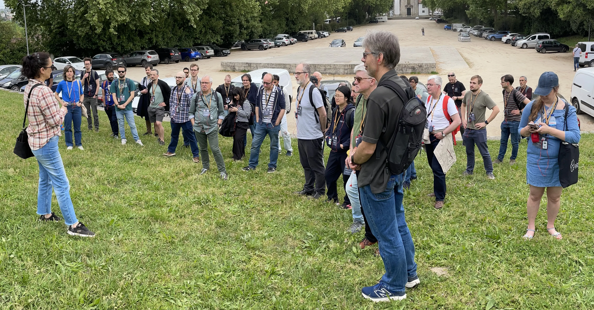{width=100%}
</figure>

We took advantage of the scenery to take a group picture of everyone who was present from the start of the event.

<figure markdown="span">
{width=100%}
</figure>

As somebody mentioned in the EasyBuild Slack when this group picture was shared with the broader community:
it doesn't look like this castle was an ... easy build (*ba-dum tsing!*).

During the tour, we passed by various interesting landmarks, like a statue of first king of Portugal.

<figure markdown="span">
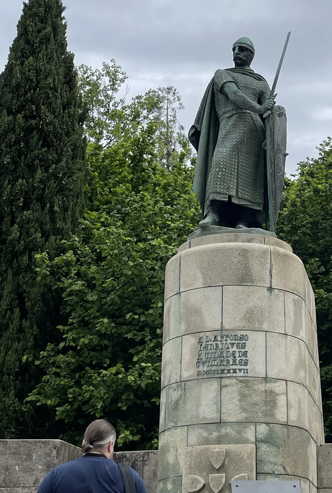{width=60%}
</figure>

Part of the old city wall made it crystal clear what Guimarães means to the Portuguese people: 
*Aqui nasceu Portugal* in Portuguese means *Portugal was born here*.

<figure markdown="span">
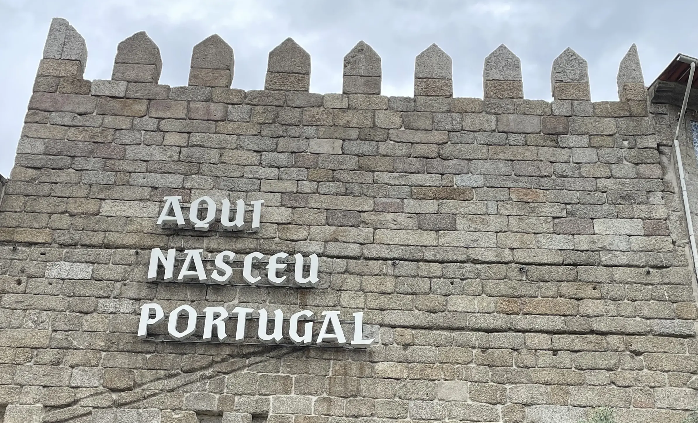{width=75%}
</figure>

Eventually, the city tour brought us exactly where we had to be: the [United Nations University (UNU) EGOV](https://unu.edu/egov/about/location)
site located in Guimarães, the main venue for this EasyBuild User Meeting.

## Welcome at the venue

After a quick welcome, and fighting the local setup to ensure that we could also stream and record all talks,
we were ready to start the actual meeting. The room was fully occupied by the almost 50 in-person attendees,
to the point where extra chairs had to be brought in.

<figure markdown="span">
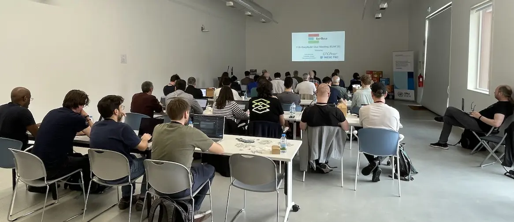{width=100%}
</figure>

## EasyBuild State of the Union

First up was the traditional *EasyBuild State of the Union* talk.
Interesting trends and results from the [9th EasyBuild User Survey](https://docs.easybuild.io/user-survey/)
were presented, recent developments were briefly highlighted (as a teaser for what was to come in later talks),
and a status update was shown on contributors and contributions to EasyBuild.

<figure markdown="span" style="display:flex; gap:0; justify-content:center;">
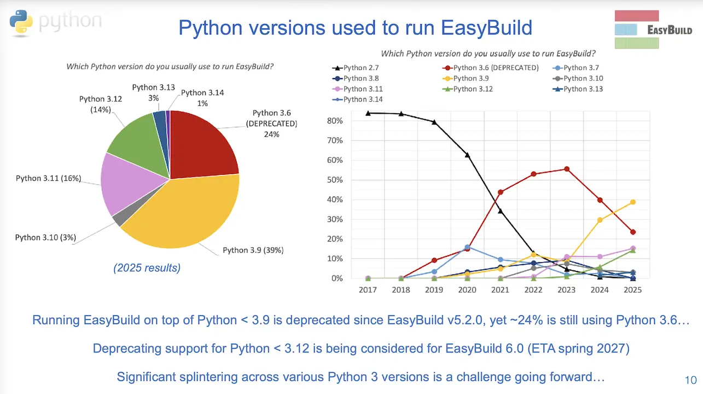{width=50%}
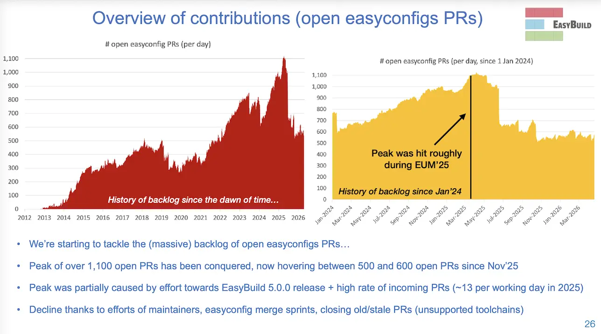{width=50%}
</figure>

In addition, the discussion was initiated around current challenges including yet another increase in number of
opened pull requests in the past year, and the threats & opportunities of AI tools like LLMs,
as well as the future of EasyBuild.

*([slides](https://users.ugent.be/~kehoste/eum26/eum26_001_state_of_the_union.pdf) - [recording](https://www.youtube.com/watch?v=2kywNPUnj_s&list=PLhnGtSmEGEQjTW4HoDDNnjBGUf4v0RgJw&index=1&pp=iAQB))*

## EasyBuild Governance

Right after the *State of the Union* talk, Adam updated attendees
on the recent efforts of the [interim Steering Committee](https://docs.easybuild.io/governance/) for EasyBuild.

<figure markdown="span" style="display:flex; gap:0; justify-content:center;">
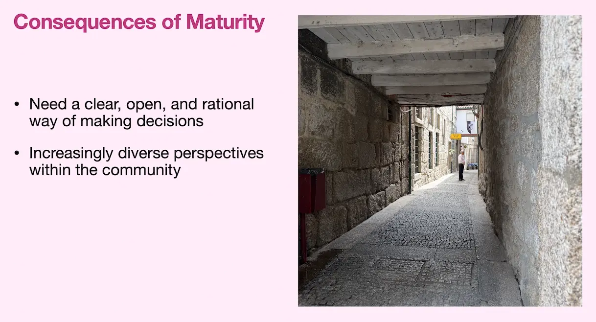{width=50%}
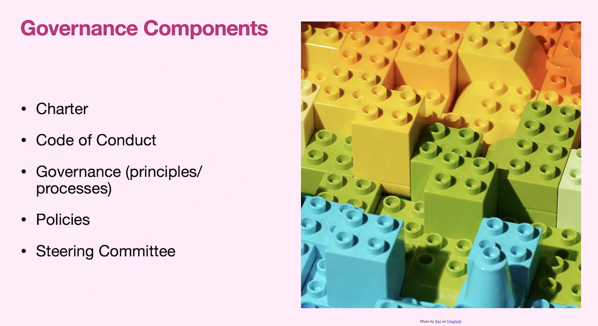{width=50%}
</figure>

After quickly covering the history of how EasyBuild came to be, he motivated the need for a steering committee,
highlighted the brand new [EasyBuild AI Policy](https://docs.easybuild.io/policies/ai/), and outlined the path
forward towards proper governance for EasyBuild.

He kindly invited the EasyBuild community to provide feedback on the [draft governance documents]().

*([slides](https://users.ugent.be/~kehoste/eum26/eum26_002_governance.pdf) - [recording](https://www.youtube.com/watch?v=rXuwGFUZqFk&list=PLhnGtSmEGEQjTW4HoDDNnjBGUf4v0RgJw&index=2&pp=iAQB0gcJCdQKAYcqIYzv))*

## HPSF

Directly tying in with the discussion on governance, the next talk introduced the
[*High Performance Software Foundation (HPSF)*](https://hpsf.io).

Massimiliano explained what HPSF is all about, how HPC providers or sites can become a member,
why projects should consider joining HPSF, and what the process entails.

<figure markdown="span" style="display:flex; gap:0; justify-content:center;">
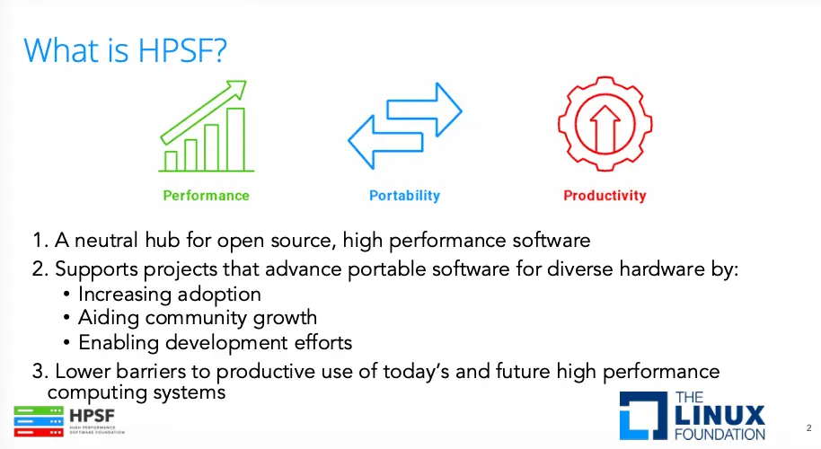{width=50%}
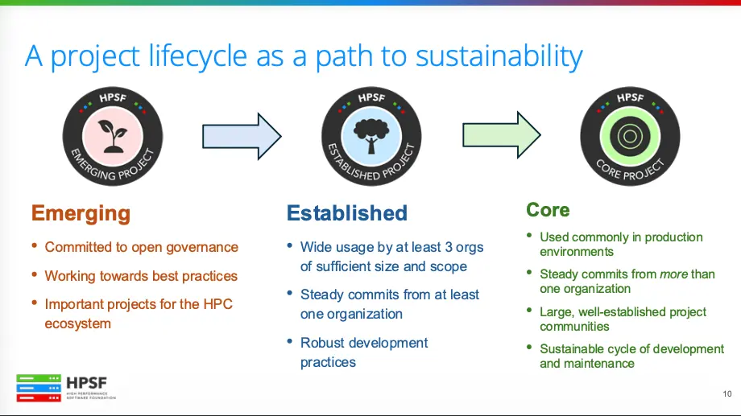{width=50%}
</figure>

Both EasyBuild and EESSI have expressed interest in joining HPSF, so this presentation was particularly
interesting to attendees.

*([slides](https://users.ugent.be/~kehoste/eum26/eum26_003_HPSF.pdf) - [recording](https://www.youtube.com/watch?v=2BeWQquZbR8&list=PLhnGtSmEGEQjTW4HoDDNnjBGUf4v0RgJw&index=4&pp=iAQB))*

## EasyBuild site talks, part 1

To wrap up the first day, 3 (actually 4) people gave a short EasyBuild site talk, another tradition that has grown 
a the EasyBuild User Meeting throughout the years.

- Bernardo shared insights on how EasyBuild has helped with managing the central software stack on *Deucalion*,
  the local EuroHPC supercomputer that features both a common AMD Rome (`x86_64`) and a less common Fujitsu A64FX (Arm) partition,
  next to a partition with NVIDIA GPUs. This heterogeneous system architectures poses significant challenges,
  w.r.t. managing a central stack of scientific software installations, which is largely overcome with the help from EasyBuild.
   *([slides](https://users.ugent.be/~kehoste/eum26/eum26_004_Deucalion.pdf) - [recording](https://www.youtube.com/watch?v=GdESGn9M81M&list=PLhnGtSmEGEQjTW4HoDDNnjBGUf4v0RgJw&index=3&pp=iAQB))*

- Cintia and Jarne presented how EasyBuild is used on the Tier-2 supercomputers at the Vrije Universiteit Brussel (VUB),
  as well as for the current and future Tier-1 supercomputers of the Flemish Supercomputer Centre ([VSC](https://vscentrum.be)),
  [*Hortense*](https://docs.vscentrum.be/gent/tier1_hortense.html) and [*sofia*](https://docs.vscentrum.be/brussel/tier1_sofia.html).
   *([slides](https://users.ugent.be/~kehoste/eum26/eum26_005_VUB.pdf) - [recording](https://www.youtube.com/watch?v=GdESGn9M81M&list=PLhnGtSmEGEQjTW4HoDDNnjBGUf4v0RgJw&t=1517s))*

- Valentin from CERN gave a (self-proclaimed) "weird" EasyBuild site talk, since CERN does not actually use EasyBuild (yet :winking_face:).
  He explained why that is the case, what is being used instead by the [LCHb experiments](https://lhcb.web.cern.ch/),
  and ended with some thought provoking ideas on a standard for package recipes that could be adopted by tools like EasyBuild, Spack, and others.
   *([slides](https://users.ugent.be/~kehoste/eum26/eum26_006_CERN.pdf) - [recording](https://www.youtube.com/watch?v=GdESGn9M81M&list=PLhnGtSmEGEQjTW4HoDDNnjBGUf4v0RgJw&t=2788s))*

---

This blog post covered the first day of this 3-day event, see also [day 2](eum26-day2.md) and [day 3](eum26-day3.md).
